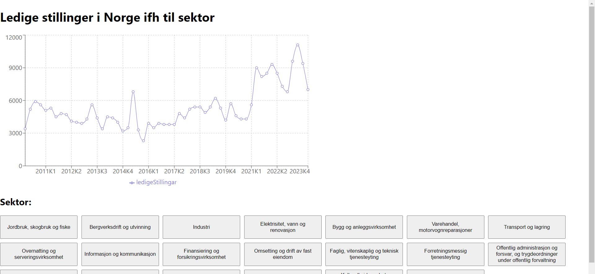

# 🇳🇴 Norwegian Job Market Status 📊

Welcome to my React app that displays the status of available jobs in Norway by sector! 🚀

## Motivation

So, here's the deal: I should be working on one of my 10 different studying obligations, so this is as much a stress relief as it is meant to be useful😅 But hey, what can I say? Coding is my passion! 💻

## What it Does

This app lets you explore the current job market in Norway based on different sectors. Just click on a button to choose a sector, and voila! You'll see a graph showing the trend of available positions over the years. 📈

## Purpose

Sure, it might seem like I'm procrastinating, but hear me out! This app is all about simplifying things for folks who are looking to enter the job market. Instead of spending hours analyzing data, they can quickly see which sectors are thriving and which ones are on the decline. It's like a cheat code for job seekers! 😉

Plus, as a seasoned tech enthusiast who knows exactly what I want (spoiler alert: it's anything related to tech, IT, etc.), I created this app with others in mind. So, whether you're a fellow tech enthusiast or someone exploring different career options, this app is for you!

## Sneak Peek

## How it Works

The app is built using React and fetches data from the SSB API. It uses Papaparse for CSV parsing and Recharts for data visualization.

## Usage

To get started, clone this repository and run `npm install` to install dependencies. Then, run `npm start` to launch the app.

## Contemplations and complaints

I was a bit surprised that the SSB-data was called an API. They were really just very large datasets in CSV/JSON format, no endpoints whatsoever.
I am slightly confused as to their definition of an API, but their data was astoundingly easy to work with.

